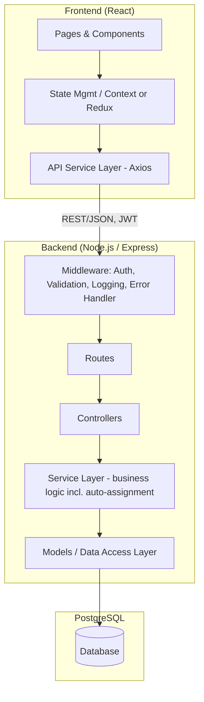
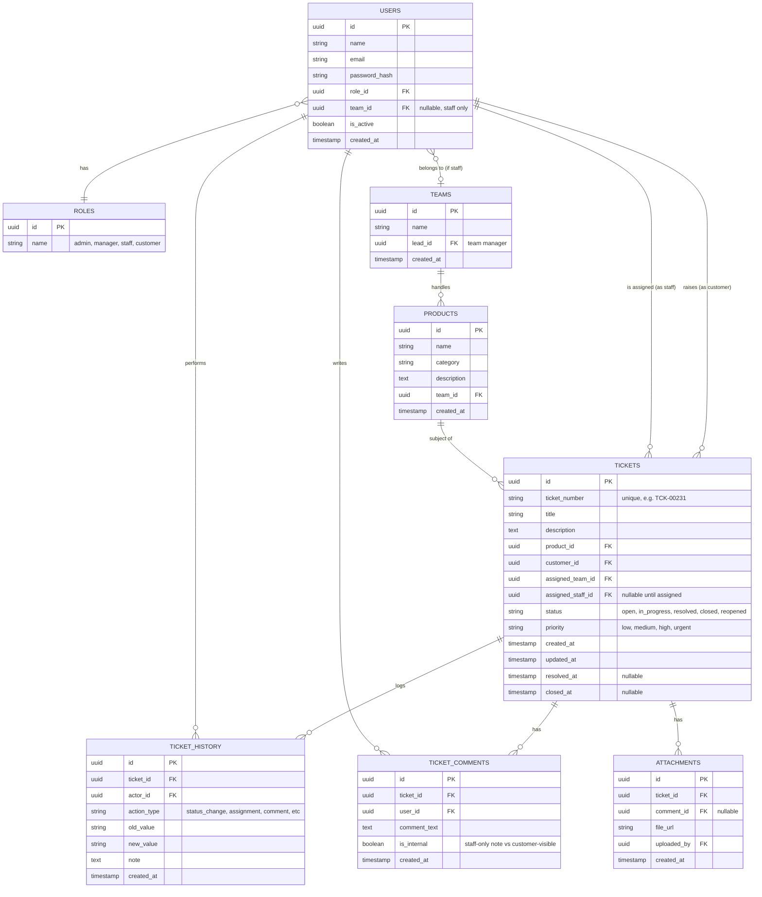
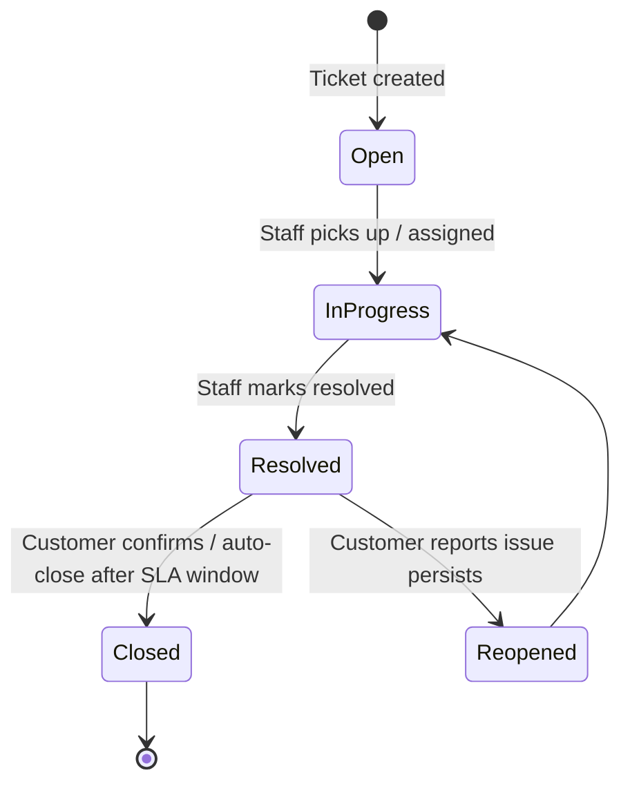

# Complaint Management System — Architecture & Design Document

**Task 3 — Glimmora International Full-Stack Trainee Programme**
**Stack:** React (frontend) · Node.js / Express (backend) · PostgreSQL (database)

---

## 1. Project Overview

A Complaint Management System (CMS) where customers raise complaints/tickets against products, the system automatically routes each ticket to the team responsible for that product, and staff manage the ticket through its full lifecycle. A Performance Dashboard sits on top, surfacing workload and resolution metrics per staff member, per team, and per product.

### 1.1 Core Functional Modules
- Complaint/Ticket Creation
- Product Management
- Auto-Assignment to Product Teams
- Ticket Status Tracking (Open → In Progress → Resolved → Closed)
- Ticket History & Activity Log
- User Roles & Permissions
- Search & Filters
- Performance Dashboard

### 1.2 Non-Functional Requirements
- Clean, layered, scalable architecture
- Input validation and consistent error handling everywhere
- Indexed, normalized database design
- JWT-based authentication, bcrypt password hashing
- Full documentation: README, API docs, setup guide
- Disciplined Git workflow with conventional commits

---

## 2. User Roles & Permissions

| Role | Description | Key Permissions |
| --- | --- | --- |
| **Admin** | System owner | Manage products, teams, users; reassign any ticket; view all dashboards; full CRUD |
| **Team Lead / Manager** | Heads a product team | View team's tickets & performance; reassign within team; cannot manage other teams |
| **Staff / Agent** | Member of a product team | View/update only tickets assigned to them; change status; add comments/notes |
| **Customer / End User** | Raises complaints | Create tickets; view/comment on own tickets; cannot see internal notes or other users' tickets |

Permission checks are enforced server-side via middleware on every protected route — never trust the frontend to hide a button as the only safeguard.

---

## 3. System Architecture

A layered (n-tier) client-server architecture, in line with the handbook's "well-organised monolith beats premature microservices" guidance for a project this size.



**Layer responsibilities:**
- **Routes** — define URL + HTTP method, attach middleware, delegate to controllers. No logic here.
- **Controllers** — parse request, call the relevant service, shape the response. No business logic, no raw SQL.
- **Services** — the business logic layer: auto-assignment rules, status-transition rules, dashboard aggregations. Framework-agnostic, easily unit-testable.
- **Models / Data Access** — query builder or ORM (e.g. Prisma or Sequelize) layer; the only layer that talks to PostgreSQL.

This separation keeps each piece testable in isolation and means the database or even the framework could be swapped without rewriting business logic.

---

## 4. Database Design

### 4.1 Entity-Relationship Diagram



### 4.2 Design Notes

- **`ticket_number`** is a separate human-readable identifier (e.g. `TCK-00231`) distinct from the internal UUID `id` — customers and staff reference this in conversation; the UUID stays internal.
- **Normalization:** customer details, product details, and team details are each stored once and referenced by foreign key from `tickets` — never duplicated onto the ticket row itself, per the single-source-of-truth principle.
- **`ticket_history`** is an append-only audit log: every status change, reassignment, or note is inserted as a new row, never updated or deleted. This is what powers both "Ticket History & Activity Logs" and a large part of the Performance Dashboard.
- **Indexes** to add explicitly (PostgreSQL does not index foreign keys automatically):
  - `tickets(status)`, `tickets(assigned_staff_id)`, `tickets(assigned_team_id)`, `tickets(product_id)`, `tickets(created_at)` — these are exactly the columns the dashboard and filters query most.
  - `tickets(ticket_number)` as a unique index.
  - `ticket_history(ticket_id)` for fast history lookups.
- **Soft state vs hard delete:** users and products are deactivated (`is_active = false`), never hard-deleted, since tickets reference them historically.

---

## 5. Ticket Lifecycle (State Machine)



Every transition is written to `ticket_history` with `old_value`, `new_value`, the `actor_id`, and an optional note. This single rule is what makes both the audit trail and the resolution-time metrics correct, so it belongs in one place: a `transitionStatus(ticketId, newStatus, actorId, note)` service function that every status-changing route calls — never an inline `UPDATE` scattered across controllers.

---

## 6. Auto-Assignment Logic

When a ticket is created for `product_id`:

1. Look up `products.team_id` to find the responsible team. If no team is mapped to that product, the ticket is created with `status = open` and `assigned_team_id = null`, and surfaced in an "Unassigned" admin queue rather than silently dropped.
2. Within that team, select a staff member using a **least-loaded** strategy: the staff member with the fewest tickets currently in `open` or `in_progress` status. This avoids the unfairness of pure round-robin when some agents are slower or away.
3. Write the assignment, set `assigned_staff_id` and `assigned_team_id`, and log an `assignment` row in `ticket_history`.
4. If the chosen team has zero active staff, fall back to the team lead and flag the ticket as `priority: high` for visibility.

```sql
-- Least-loaded staff in a team
SELECT u.id
FROM users u
LEFT JOIN tickets t
  ON t.assigned_staff_id = u.id AND t.status IN ('open', 'in_progress')
WHERE u.team_id = :teamId AND u.is_active = true
GROUP BY u.id
ORDER BY COUNT(t.id) ASC
LIMIT 1;
```

This logic lives in `services/assignmentService.js`, isolated from the controller, so the assignment strategy can be changed later (e.g. to skill-based or round-robin) without touching route code.

---

## 7. API Design (REST, versioned under `/api/v1`)

| Method | Endpoint | Purpose | Role |
| --- | --- | --- | --- |
| POST | `/api/v1/auth/register` | Register (customer signup) | Public |
| POST | `/api/v1/auth/login` | Login, issue JWT | Public |
| GET | `/api/v1/products` | List products | All authenticated |
| POST | `/api/v1/products` | Create product | Admin |
| GET | `/api/v1/teams` | List teams | Admin, Manager |
| POST | `/api/v1/teams` | Create team | Admin |
| POST | `/api/v1/tickets` | Create ticket (triggers auto-assignment) | Customer |
| GET | `/api/v1/tickets` | List tickets (filtered/paginated) | Role-scoped |
| GET | `/api/v1/tickets/:id` | Ticket detail + history | Role-scoped |
| PATCH | `/api/v1/tickets/:id/status` | Transition status | Staff, Manager, Admin |
| PATCH | `/api/v1/tickets/:id/assign` | Reassign ticket | Manager, Admin |
| POST | `/api/v1/tickets/:id/comments` | Add comment/note | Role-scoped |
| GET | `/api/v1/tickets/search` | Search/filter tickets | Role-scoped |
| GET | `/api/v1/dashboard/staff/:id` | Staff performance metrics | Staff (self), Manager, Admin |
| GET | `/api/v1/dashboard/team/:id` | Team performance metrics | Manager, Admin |
| GET | `/api/v1/dashboard/products` | Product-wise complaint analysis | Manager, Admin |

`GET`/`PUT`/`DELETE` are idempotent by design; `PATCH` on status/assignment is treated as idempotent (re-sending the same status produces the same end state, not a duplicate history entry — the service checks for a no-op transition).

---

## 8. Search & Filters

Implemented server-side (never filter large result sets client-side), via query parameters on `GET /api/v1/tickets`:

- `status`, `priority`, `product_id`, `assigned_staff_id`, `assigned_team_id`
- `date_from` / `date_to` (on `created_at`)
- `q` — free-text search across `title` and `ticket_number` (PostgreSQL `ILIKE` for this scale; `tsvector` full-text search if volume grows)
- Pagination via `page` / `page_size`, capped at a sane max (e.g. 100) to protect the server

---

## 9. Performance Dashboard — Metrics & Source Queries

| Metric | Computation |
| --- | --- |
| Tickets assigned per staff | `COUNT(*) GROUP BY assigned_staff_id` |
| Tasks completed | `COUNT(*) WHERE status IN ('resolved','closed') GROUP BY assigned_staff_id` |
| Pending tickets | `COUNT(*) WHERE status IN ('open','in_progress') GROUP BY assigned_staff_id` |
| Avg resolution time (staff/team/product) | `AVG(resolved_at - created_at) GROUP BY <dimension>` |
| Time taken per ticket | `resolved_at - created_at` (or `closed_at - created_at`) per row |
| Staff-wise performance | Completed count + avg resolution time + pending count, combined |
| Product-wise complaint analysis | Ticket count and avg resolution time `GROUP BY product_id` |
| Team performance metrics | Backlog size, avg resolution time, completed count `GROUP BY assigned_team_id` |

All of these are read-heavy aggregate queries against `tickets` and rely entirely on the indexes listed in §4.2. For dashboards refreshed often under real load, consider a nightly materialized view (`dashboard_staff_stats`, `dashboard_team_stats`) refreshed via a scheduled job rather than recomputing on every page load — a good Phase 2 optimization, not needed for the first working version.

---

## 10. Backend Project Structure

```
server/
├── src/
│   ├── config/          # env loading, db connection pool
│   ├── middleware/       # auth, validation, error handler, logger
│   ├── routes/           # one file per resource
│   ├── controllers/       # request/response shaping only
│   ├── services/          # business logic (assignment, status transitions, dashboard)
│   ├── models/            # data access layer (queries / ORM models)
│   ├── utils/              # helpers (e.g. ticket-number generator)
│   └── app.js
├── migrations/             # version-controlled schema changes
├── tests/
│   ├── unit/
│   └── integration/
├── .env.example
├── .gitignore
└── package.json
```

## 11. Frontend Project Structure

```
client/
├── src/
│   ├── pages/             # TicketList, TicketDetail, Dashboard, ProductAdmin...
│   ├── components/         # reusable: StatusBadge, TicketCard, FilterBar...
│   ├── hooks/                # useTickets, useAuth, custom hooks
│   ├── context/ (or store/)   # auth state, role-based UI gating
│   ├── services/                # api.js — single Axios instance + endpoint calls
│   ├── utils/
│   └── App.jsx
├── .env.example
└── package.json
```

---

## 12. Security & Validation Checklist

- Passwords hashed with bcrypt; never logged or returned in any response.
- JWT issued on login, verified by auth middleware on every protected route; role embedded in the token payload and re-checked server-side per request — never trusted from the client.
- All input validated server-side (e.g. with Joi or Zod schemas) before it reaches a service or query — request bodies, query params, and route params alike.
- All database access parameterized (no string-concatenated SQL) to prevent SQL injection.
- Centralized error-handling middleware returns consistent `{ error: { code, message } }` shapes and never leaks stack traces in production.
- Secrets (DB credentials, JWT secret) only in environment variables, never committed; `.env.example` checked in, `.env` git-ignored.
- Rate limiting on `/auth` routes to slow brute-force login attempts.

---

## 13. Git Workflow

Following the handbook's branching model:

- `main` — always stable and deployable.
- `develop` — integration branch (optional but recommended at this scope, since multiple modules are being built in parallel: tickets, products, auth, dashboard).
- `feature/<name>` per module, e.g. `feature/ticket-creation`, `feature/auto-assignment`, `feature/dashboard-staff-metrics`.
- Conventional Commits throughout: `feat:`, `fix:`, `refactor:`, `docs:`, `test:`.
- Small, frequent PRs per module rather than one giant PR at the end; require review before merge into `develop`.

---

## 14. Documentation Plan

Three deliverables, written as the corresponding module is built rather than all at the end:

1. **README.md** — what the system does, tech stack, local setup instructions, folder structure overview.
2. **API_DOCS.md** (or generated via Swagger/OpenAPI) — every endpoint from §7 with request/response shapes and example payloads.
3. **SETUP_GUIDE.md** — step-by-step: clone, install dependencies, configure `.env`, run migrations, seed sample products/teams, start dev servers.

---

## 15. Suggested Build Order (Phases)

| Phase | Scope | Outcome |
| --- | --- | --- |
| 1 | DB schema + migrations, auth (register/login/JWT), Users/Roles/Teams/Products CRUD | Foundation usable by every later module |
| 2 | Ticket creation + auto-assignment service + status transition service | Core complaint flow works end to end |
| 3 | Ticket history log, comments, search/filters | Full lifecycle visibility |
| 4 | Frontend: auth pages, ticket list/detail, role-based views | Usable UI for customers and staff |
| 5 | Performance Dashboard (backend aggregations + frontend charts) | Reporting layer complete |
| 6 | Testing (unit on services, integration on key endpoints), polish, docs finalized | Submission-ready |

---

*Prepared as the Phase 1 design deliverable for Task 3 — Complaint Management System, Glimmora International Full-Stack Trainee Programme.*
